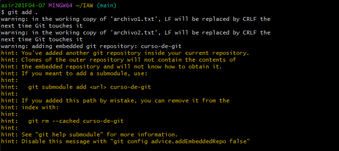
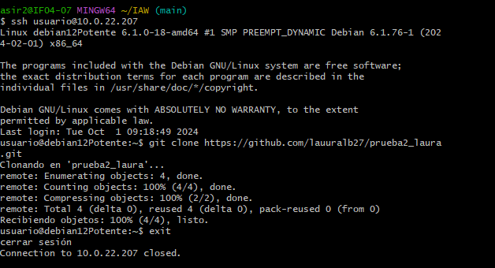
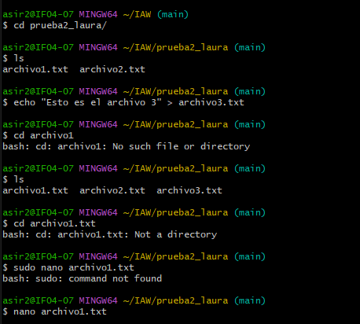
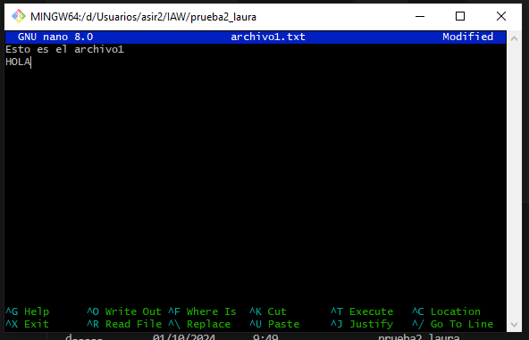
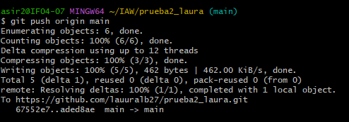
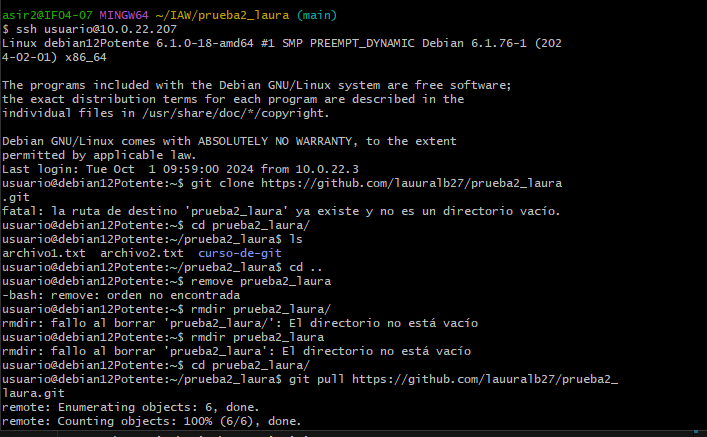
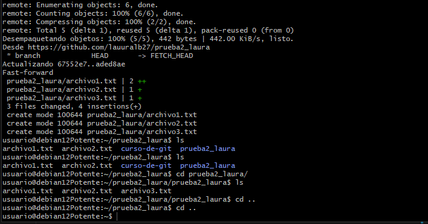

# Ejercicio 1

## Crear el repositorio

Creamos el repositorio prueba2_laura

## Iniciar el repositorio

Iniciamos el repositorio con el comando git init

## Renombrar la rama actual a main

Renombramos la rama actual a main

## Creamos archivo1.txt y archivo2.txt

Creamos los archivos 1 y 2 .txt con el comando echo

## Añadimos todos los archivos y cambios en el directorio actual 

Añadimos todos los archivos y cambios en el directorio actual 

## Mensaje de cambios

Proporcionamos un mensaje que describa los cambios que se están registrando.

## Vincular repositorio

Vinculamos un repositorio Git local con un repositorio remoto.

## Enviar cambios

Enviamos los cambios que has realizado en tu repositorio local a la rama main del repositorio remoto.

## Conectar a Linux 

Nos conectamos a linux mediante ssh usuario@IP

## Creamos archivo 3 y modificamos archivo 1

Creamos el archivo, modificamos el archivo 1 y comprobamos

## Texto que he modificado

Modificamos el archivo 1

## Añadir cambios 

Añadimos todos los archivos y cambios del directorio actual 

## Añadir comentario de los cambios

Añadimos y guardamos los cambios añadiendo un comentario de lo que hemos hecho

## Enviar cambios al repositorio

Enviamos los cambios que has realizado en tu rama main local hacia la rama main en el repositorio remoto

## Conectarnos otra vez a linux

Una vez conectado entraremos a la carpeta prueba2_laura y comprobaremos todo lo q hemos hecho y actualizaremos el  repositorio local con los cambios más recientes del repositorio remoto
