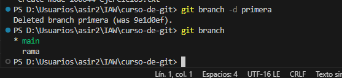

# Ejercicio 3

## Crear una rama llamada primera
Crea una rama que se llame primera en un repositorio local, y ejecuta la instrucción necesaria para comprobar que se ha creado.

## Nuevo fichero
Crea un nuevo fichero en esta rama y fusiónalo con la principal. ¿Se ha producido conflicto? Razona la respuesta.
 No hay ningun conflicto ya que no hay cambios en las dos ramas.

## Borrar rama primera
Borra la rama primera.

## Crea una rama que se llame segunda, y modifica el fichero
Crea una rama que se llame segunda, y modifica un fichero en ella para producir un conflicto al unirlo a la rama principal. Entrega el contenido del fichero donde se ha producido el conflicto.

#### Guardar cambios

#### modifico en main tambien y guardo cambios

## Conflicto

## Conflicto resuelto

## Ramas repositorio
Entrega una captura de pantalla donde se vea que se ha creado la rama en el repositorio de GitHub.

