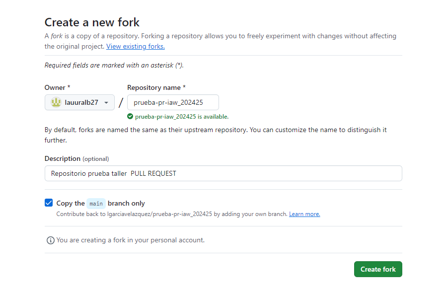
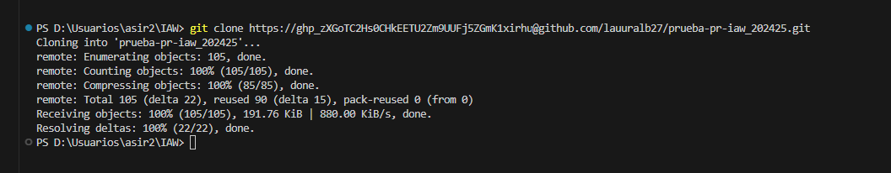
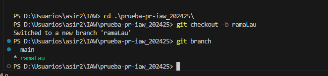
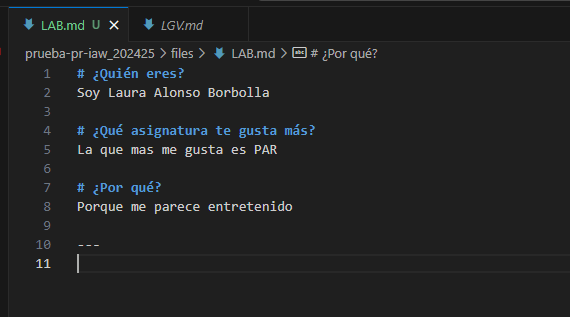
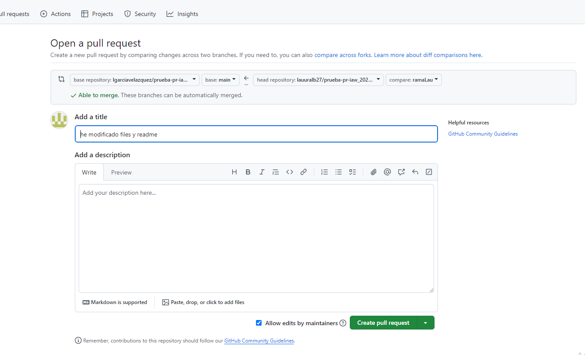
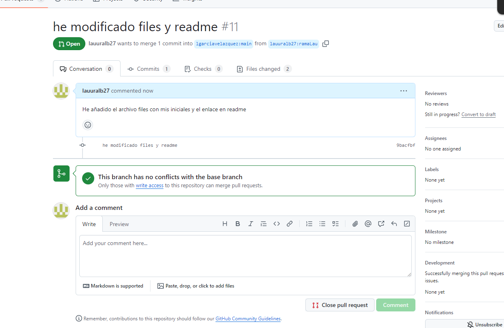

# Ejercicio 4

## Crear el fork 

Para ello entraremos en la url del repositorio que queremos hacer el pull request:

## Clonar repositorio
Una vez que hemos copiado el repositorio a nuestra cuenta, podemos clonar ese repositorio.

## Crear nueva rama
A continuación vamos a crear una nueva rama, donde realizaremos los cambios que posteriormente propondremos como cambios. Para crear la rama ejecutamos:

## Crear documento con nuestras iniciales 
Crearemos un documento con nuestas iniciales y dentro del documento responderemos a unas preguntas.

## Añadir el docuemento 

## Pull-Request
Tenemos que crear el Pull Requests desde la página de GitHub. Comprobamos que nos aparece un cuadro que nos dice que hemos hecho cambios en una nueva rama y podemos crear un nuevo Pull Requests para proponer dichos cambios, para ello pulsamos el botón Caompare & pull request: 

## Recibido el Request
